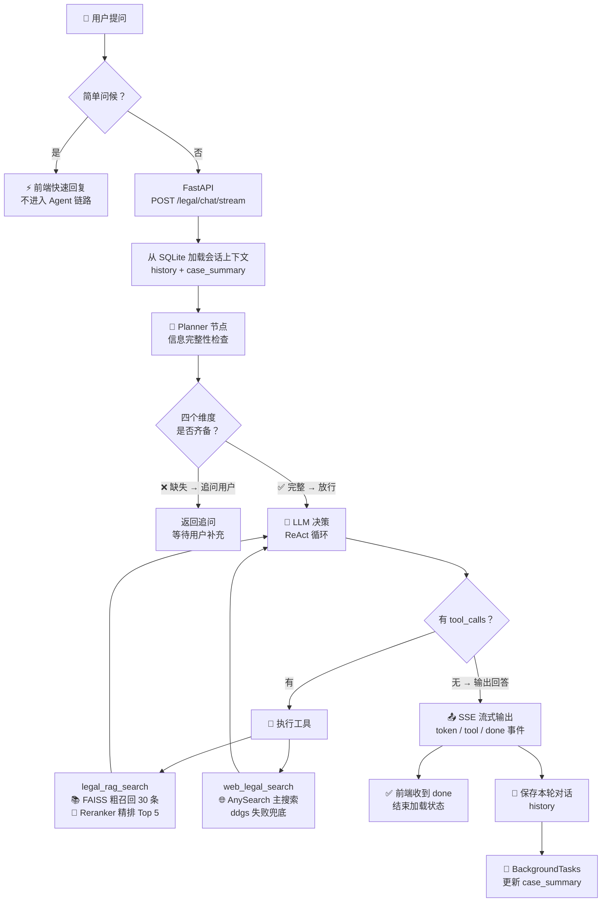

# AI 法律助手

基于 **LangGraph + RAG + FastAPI** 的智能法律问答系统。Agent 先通过 Planner 节点判断用户信息是否完整（缺失则追问），信息完备后自主决策调用 RAG 法条检索或联网搜索，整合后给出带来源标注的回答；会话历史与案情摘要使用 SQLite 持久化。前端会在浏览器本地保存当前 `session_id`，刷新页面后恢复该会话。

对“你好”“谢谢”等简单输入，前端优先走快速回复，避免进入 Planner、LLM 与工具调用；完整回答通过 SSE 逐事件推送，回答结束后再由后台更新案情摘要，避免摘要生成阻塞用户界面。

## 界面展示

**完整对话流程** — Planner 追问 + RAG 检索 + 工具调用 + 结构化回答


**案情摘要（侧边栏）** — 两层记忆机制：LLM 增量提取结构化案情


## 架构



## 项目结构

```
legal_agent/
├── main.py                  # FastAPI 入口
├── frontend/                # React + TypeScript + Tailwind 前端
│   ├── src/
│   │   ├── components/      # ChatArea, Sidebar, InputBox 等
│   │   └── App.tsx
│   └── dist/                # 构建产物（npm run build）
├── agent/
│   └── legal_agent.py       # LangGraph 智能体（Planner + ReAct）
├── tools/
│   └── legal_tools.py       # legal_rag_search + web_legal_search
├── rag/
│   └── retriever.py         # FAISS 检索 + Reranker + 自定义 OllamaEmbeddings
├── memory/
│   └── case_memory.py       # SQLite 会话持久化 + LLM 案情摘要
├── evaluation/              # 检索评测、参数调优与原始结果
├── build_vectorstore.py     # 构建向量库（首次运行执行一次）
├── legal_pdfs/              # 法律 PDF 源文件
└── docs/                    # 学习笔记与周报
```

## 技术栈

| 组件 | 技术 |
|------|------|
| LLM | GLM-4.7（智谱 AI） |
| Agent 框架 | LangGraph（手写 StateGraph，含 Planner + ReAct） |
| 向量库 | FAISS（本地） |
| Embedding | nomic-embed-text（Ollama 本地服务） |
| Reranker | BAAI/bge-reranker-base（CrossEncoder） |
| Web 搜索 | AnySearch（主搜索）+ ddgs（失败兜底） |
| 后端 | FastAPI + Uvicorn |
| 会话持久化 | SQLite |
| 前端 | React + TypeScript + Tailwind CSS |

## 快速开始

### 1. 环境准备

```bash
# 克隆仓库
git clone https://github.com/an-s57/legal_agent.git
cd legal_agent

# 创建虚拟环境
python -m venv .venv
.venv\Scripts\activate    # Windows
# source .venv/bin/activate  # Linux/Mac

# 安装依赖
pip install -r requirements.txt
```

### 2. 配置

先复制示例配置，再在项目根目录填写 `.env`：

```powershell
Copy-Item .env.example .env
```

`.env` 内容：

```
GLM_API_KEY=你的智谱API密钥
# 联网搜索主服务；未配置或调用失败时会自动尝试 ddgs 兜底
ANYSEARCH_API_KEY=你的AnySearch密钥
```

### 3. 启动 Ollama Embedding 服务

确保 Ollama 服务正在运行，并拉取嵌入模型：

```bash
# 安装 Ollama 后拉取嵌入模型
ollama pull nomic-embed-text
```

### 4. 构建向量库

将法律 PDF 文件放入 `legal_pdfs/` 目录，然后执行：

```bash
python build_vectorstore.py
```

### 5. 构建前端（首次运行或前端代码变化后必须执行）

```bash
cd frontend
npm ci
npm run build      # 生成 dist/
cd ..
```

### 6. 启动服务

```bash
python main.py
# 或 uvicorn main:app --host 127.0.0.1 --port 8000 --reload
```

访问 http://localhost:8000

### 7. 运行基础回归测试

该测试只验证 SQLite 会话的保存与恢复，不调用 Ollama、GLM 或联网搜索：

```bash
python -m unittest discover -s tests -v
```

### 使用边界

本项目用于学习和本地演示，不构成法律意见。当前版本没有用户登录与会话归属校验，虽然默认只监听本机地址，仍不应直接部署到公网或录入真实敏感案情。

## API 接口

### POST /legal/chat/stream

前端实际使用的流式问答接口。请求体与 `/legal/chat` 相同，响应类型为 `text/event-stream`。

服务端可能发送以下事件：

- `token`：增量回答文本；
- `planner_question`：信息不完整时的追问；
- `tool_start` / `tool_end`：工具调用状态；
- `done`：本轮输出结束，前端据此关闭加载状态。

### POST /legal/chat

发送法律问题，获取智能回答。

```json
// Request
{
  "session_id": "session-001",
  "message": "拖欠工资三个月，我该怎么维权？"
}

// Response
{
  "answer": "根据《劳动合同法》...",
  "session_id": "session-001",
  "tools_used": ["legal_rag_search"],
  "case_summary": {
    "case_type": "劳动纠纷",
    "event_description": "公司拖欠三个月工资",
    "user_claim": "维权追回工资"
  }
}
```

### GET /legal/session/{session_id}

查询指定会话的历史记录和案情摘要。

### GET /health

健康检查。

## 核心设计

### Planner 节点：先收集信息，再回答

在传统 ReAct 之前增加 Planner 节点，判断用户输入是否包含四个关键维度（事件描述、时间、损失、诉求）。缺失则生成自然的追问，信息完备后才进入检索+回答流程。Planner 将信息完整性判断与追问生成合并在同一次调用中，减少不必要的检索与工具调用。

### 为什么手写 LangGraph StateGraph？

`create_agent()` 是黑盒，手写 StateGraph 可以完全控制 Agent 的状态流转：每个节点（`planner`、`llm`、`tools`）和边（条件跳转 `should_continue`）都是显式定义的，便于调试和扩展。

### 为什么自定义 OllamaEmbeddings？

`langchain_ollama.OllamaEmbeddings` 与当前安装的 Ollama 客户端版本不兼容。自定义类直接用 `httpx` 调用 Ollama 旧版 `/api/embeddings` 接口，并设置 `trust_env=False` 避免被系统代理拦截。

### 两层记忆机制

- **短期记忆**：保存原始对话历史（`history`），用于上下文连续性
- **长期记忆**：LLM 增量提取案情摘要（`case_summary`），压缩为结构化 JSON（案件类型/关键事实/用户诉求）
- 两类数据均按 `session_id` 保存到 SQLite，在服务重启后可恢复并注入下一轮对话

### Reranker 二次排序

FAISS 粗召回 30 条后，用 CrossEncoder（`bge-reranker-base`）对 query-doc 对重新打分，取 Top-5。当前参数由 50 道人工标注检索题调优得到：在 17 道验证题上，正确来源命中率为 17/17，严格证据命中率为 15/17（88.2%）。

### 性能 Trace 与链路排查

每个请求会生成独立 `trace_id`。当前后端终端已记录 `vectorstore_load`、`vector_search`、`rerank`、联网搜索服务及耗时、请求总耗时等信息；其中 CPU 上的 Reranker 通常是已记录链路中最显著的耗时项。Planner 与每轮 LLM 的独立耗时尚未打点，因此不能仅凭总耗时把等待全部归因给某个模型；下一步会补齐这两个阶段及首 token 时间（TTFT）的日志。当前日志仅输出到本地终端，后续可写入结构化 JSONL 或日志平台。

### 联网搜索服务选型（20 题对比）

为避免把“工具选择正确”与“工具执行质量”混为一谈，项目对联网搜索服务进行了独立评测：相同的 20 道法律查询、相同 Top-3 数量、相同查询后缀下，对比新版 DuckDuckGo 接入（`ddgs`）与 AnySearch。

| 服务 | 官方来源命中@3 | 自动通过@3 | 平均耗时 |
| --- | ---: | ---: | ---: |
| DuckDuckGo（ddgs） | 9/20（45.0%） | 8/20（40.0%） | 4.24 s |
| AnySearch | 19/20（95.0%） | 19/20（95.0%） | 1.52 s |

其中，**官方来源命中@3** 指 Top-3 是否至少包含一条预标注的政府、法院、人社或法规数据库链接；**自动通过@3** 则要求同时命中官方来源与核心主题。AnySearch 在该评测中胜出，平均网页搜索耗时约低 **64%**，因此现已作为当前演示版本的主搜索；调用异常、缺少密钥或返回异常时自动回退到 `ddgs`。已完成主服务直连、强制回退和 UI SSE 链路验证。完整指标定义、原始结果和已知失败案例见 [evaluation/README.md](./evaluation/README.md)。

## 检索评测与参数选择

使用 33 道开发题选择检索参数，再以 17 道验证题确认。当前线上配置为 **FAISS 粗召回 K=30、Reranker 返回 Top-K=5**；完整的题集边界、指标定义、耗时、原始结果与复现命令见 [evaluation/README.md](./evaluation/README.md)。

## License

MIT。详见 [LICENSE](./LICENSE)。
