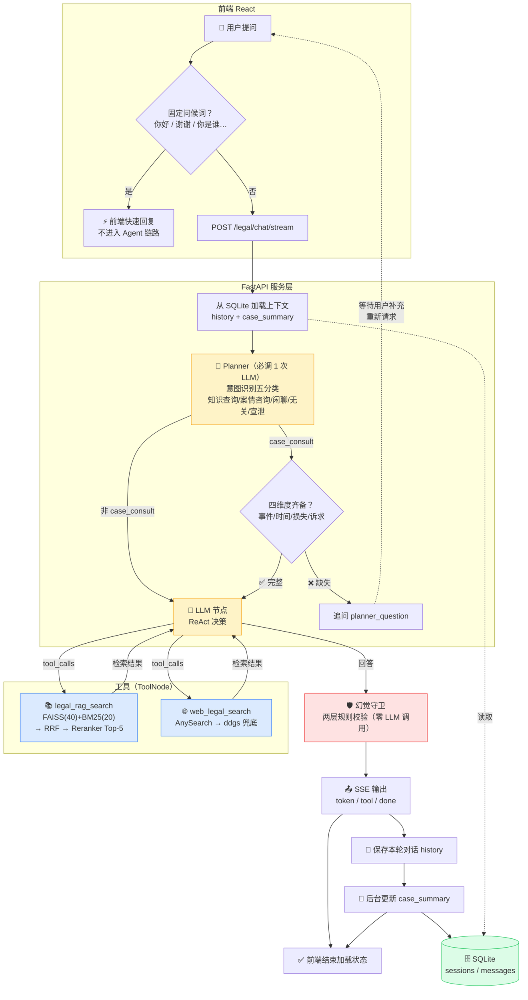

# AI 法律助手

[](https://github.com/an-s57/legal_agent/actions/workflows/ci.yml)

基于 **LangGraph + RAG + FastAPI** 的智能法律问答系统。Agent 链路：Planner 节点先做**一次 LLM 调用完成意图识别（五分类）**，仅对"个人案情咨询"检查四个维度信息（事件/时间/损失/诉求）是否完整、缺失则追问，放行后进入 ReAct 循环自主决策调用 RAG 法条检索（FAISS 向量 + BM25 词面混合召回 + Reranker 精排）或联网搜索，回答经幻觉守卫校验后带来源标注输出；会话历史与案情摘要使用 SQLite 持久化。前端会在浏览器本地保存当前 `session_id`，刷新页面后恢复该会话。

对“你好”“谢谢”等简单输入，前端优先走快速回复，避免进入 Planner、LLM 与工具调用；完整回答通过 SSE 逐事件推送，回答结束后再由后台更新案情摘要，避免摘要生成阻塞用户界面。

## 界面展示

**完整对话流程** — Planner 意图识别与追问 + RAG 检索 + 工具调用 + 幻觉守卫 + 结构化回答


**案情摘要** — 两层记忆机制：LLM 增量提取结构化案情（界面截图可能滞后于最新前端）


## 架构



## 项目结构

```
legal_agent/
├── main.py                  # FastAPI 入口
├── config.py                # 全部可调参数/常量集中管理（单一数据源）
├── logger.py                # 统一日志配置（stderr 输出，LOG_LEVEL 可调）
├── mcp_server.py            # MCP server：把两个工具暴露给任意 MCP 客户端
├── mcp_client_demo.py       # 最小 MCP 客户端 demo（官方 mcp SDK，三步流程）
├── Dockerfile               # 后端镜像（CPU torch + 依赖 + 前端产物）
├── docker-compose.yml       # 编排 Ollama 与后端，注入配置与挂载
├── .dockerignore            # 构建上下文过滤（.env / .venv 不进镜像）
├── frontend/                # React + TypeScript + Tailwind 前端
│   ├── src/
│   │   ├── components/      # ChatArea, Sidebar, InputBox 等
│   │   └── App.tsx
│   └── dist/                # 构建产物（npm run build）
├── agent/
│   ├── legal_agent.py       # LangGraph 智能体（Planner + ReAct）
│   └── hallucination_guard.py  # 两层规则幻觉守卫
├── tools/
│   └── legal_tools.py       # legal_rag_search + web_legal_search
├── rag/
│   ├── retriever.py         # 检索入口：混合召回 + Reranker + 自定义 OllamaEmbeddings
│   ├── hybrid.py            # FAISS 向量 + BM25 词面 + RRF 融合
│   └── vectorstore/         # 本地 FAISS 向量库（build_vectorstore.py 生成）
├── memory/
│   └── case_memory.py       # SQLite 会话持久化 + LLM 案情摘要
├── evaluation/              # 检索评测、参数调优与原始结果
├── tests/                   # 离线单元测试（不依赖 Ollama / LLM / 联网）
├── build_vectorstore.py     # 构建向量库（首次运行执行一次）
├── legal_pdfs/              # 法律 PDF 源文件
└── docs/                    # 学习笔记与周报
```

## 技术栈

| 组件 | 技术 |
|------|------|
| LLM | DeepSeek V4 Flash（deepseek-v4-flash） |
| Agent 框架 | LangGraph（手写 StateGraph，含 Planner + ReAct） |
| 向量库 | FAISS（本地） |
| Embedding | nomic-embed-text（Ollama 本地服务） |
| Reranker | BAAI/bge-reranker-base（CrossEncoder，INT8 量化） |
| 混合检索 | FAISS 向量 + BM25 词面（jieba 分词）+ RRF 融合 |
| Web 搜索 | AnySearch（主搜索）+ ddgs（失败兜底） |
| 后端 | FastAPI + Uvicorn |
| 会话持久化 | SQLite |
| 前端 | React + TypeScript + Tailwind CSS |

## 快速开始

### 1. 环境准备

```bash
# 克隆仓库
git clone https://github.com/an-s57/legal_agent.git
cd legal_agent

# 创建虚拟环境
python -m venv .venv
.venv\Scripts\activate    # Windows
# source .venv/bin/activate  # Linux/Mac

# 安装依赖
pip install -r requirements.txt
```

### 2. 配置

先复制示例配置，再在项目根目录填写 `.env`：

```powershell
Copy-Item .env.example .env
```

`.env` 内容：

```
DEEPSEEK_API_KEY=你的DeepSeek API密钥
# 联网搜索主服务；未配置或调用失败时会自动尝试 ddgs 兜底
ANYSEARCH_API_KEY=你的AnySearch密钥
```

### 3. 启动 Ollama Embedding 服务

确保 Ollama 服务正在运行，并拉取嵌入模型：

```bash
# 安装 Ollama 后拉取嵌入模型
ollama pull nomic-embed-text
```

### 4. 构建向量库

将法律 PDF 文件放入 `legal_pdfs/` 目录，然后执行：

```bash
python build_vectorstore.py
```

### 5. 构建前端（首次运行或前端代码变化后必须执行）

```bash
cd frontend
npm ci
npm run build      # 生成 dist/
cd ..
```

### 6. 启动服务

```bash
python main.py
# 或 uvicorn main:app --host 127.0.0.1 --port 8000 --reload
```

访问 http://localhost:8000

### 7. 运行单元测试

回归测试覆盖：SQLite 会话持久化、混合检索（RRF 融合 + 双路召回）、幻觉守卫（引用提取/校验）、Agent 层（历史截断 + Planner 决策，LLM 用 stub 替换）。全部**离线运行**：不调用 Ollama、DeepSeek 或联网搜索：

```bash
python -m unittest discover -s tests -v
```

### 8. 使用 Docker 部署（可选）

项目提供容器化三件套（`Dockerfile` / `docker-compose.yml` / `.dockerignore`），一条命令起服务：

```bash
docker compose up -d --build
```

- **Dockerfile**：基于 `python:3.13-slim`，先装 CPU 版 torch，再装依赖、拷入项目代码与前端构建产物，`uvicorn main:app` 启动
- **docker-compose.yml**：编排 Ollama（embedding 服务）与后端；宿主机 `8000` 端口映射；从 `.env` 注入 API Key（不写进镜像）；挂载 SQLite 数据（`./data`）与 HuggingFace 模型缓存（只读）
- **.dockerignore**：排除 `.env`、`.env.example`、`.venv` 等，防止真实 API Key 与 1.2G 虚拟环境进构建上下文

启动后访问 http://localhost:8000（前端已内置到镜像）。注意：容器内 Ollama embedding 走 `http://ollama:11434`，首次启动需等模型拉取。

### 使用边界

本项目用于学习和本地演示，不构成法律意见。当前版本没有用户登录与会话归属校验，虽然默认只监听本机地址，仍不应直接部署到公网或录入真实敏感案情。

## API 接口

### POST /legal/chat/stream

前端实际使用的流式问答接口。请求体与 `/legal/chat` 相同，响应类型为 `text/event-stream`。

服务端可能发送以下事件：

- `token`：增量回答文本；
- `planner_question`：信息不完整时的追问；
- `tool_start` / `tool_end`：工具调用状态；
- `done`：本轮输出结束，前端据此关闭加载状态；
- `case_summary`：本轮案情摘要更新后的最新结构化摘要（在 `done` 之后到达，前端据此更新本地摘要状态）；
- `error`：流式处理中途出错时的错误事件（携带 `message` 字段）。

### POST /legal/chat

发送法律问题，获取智能回答。

```json
// Request
{
  "session_id": "session-001",
  "message": "拖欠工资三个月，我该怎么维权？"
}

// Response
{
  "answer": "根据《劳动合同法》...",
  "session_id": "session-001",
  "tools_used": ["legal_rag_search"],
  "case_summary": {
    "case_type": "劳动纠纷",
    "event_description": "公司拖欠三个月工资",
    "user_claim": "维权追回工资"
  }
}
```

### GET /legal/session/{session_id}

查询指定会话的历史记录和案情摘要。

### GET /health

健康检查。

## MCP Server（可选）

项目把两个核心工具（`legal_rag_search` 法条检索、`web_legal_search` 联网搜索）包装成标准 **MCP server**（[mcp_server.py](mcp_server.py)），任何支持 MCP 的客户端（Claude Desktop、Cursor 等）都可以直接调用，工具逻辑与主项目完全复用、零重复实现。

通信走 **stdio**：协议消息（JSON-RPC）走 stdout，日志走 stderr（见 [logger.py](logger.py) 的设计说明），两者互不干扰。

```bash
# 启动（默认 stdio 传输）
python mcp_server.py

# 命令行直接调用工具（最快验证方式，无需任何客户端）
fastmcp call mcp_server.py legal_rag_search '{"query": "消费者权益保护法第五十五条"}'

# 或启动 FastMCP 网页调试器（MCP Inspector），可视化测试工具调用
fastmcp dev inspector mcp_server.py
```

不带任何商业客户端也能完整验证：`mcp_client_demo.py` 是用官方 `mcp` SDK 写的最小客户端（三步：握手 → 拿工具清单 → 调用工具），跑 `python mcp_client_demo.py` 即可看到完整流程（路径默认按 WSL 写，可用参数覆盖）。

以 Claude Desktop 为例，在 `claude_desktop_config.json` 中注册（WSL 路径示例）：

```json
{
  "mcpServers": {
    "legal-agent": {
      "command": "/home/an/legal_agent/venv/bin/python",
      "args": ["/home/an/legal_agent/mcp_server.py"]
    }
  }
}
```

Windows 侧同理：`command` 改为 `.venv\Scripts\python.exe`，`args` 指向 `D:\legal_agent\mcp_server.py`。

> 注意：调用工具时需要 Ollama 在运行且向量库已构建（与主项目同一前置条件）。

## 核心设计

### Planner 节点：意图识别 + 信息收集

在传统 ReAct 之前增加 Planner 节点，该节点每次请求**固定调用一次 LLM**（temperature=0，结构化输出），先做**五分类意图识别**：`knowledge_query`（客观法条/知识查询）、`case_consult`（个人案情咨询）、`chitchat`（闲聊）、`non_legal`（无关内容）、`complaint`（情绪宣泄）。

- 仅对 `case_consult` 进一步检查四个关键维度（**事件描述、发生时间、损失/后果、用户诉求**），缺失则生成自然的追问（`planner_question` 事件）并结束本轮，等待用户补充后重新走 Planner；
- 其余四类（知识查询/闲聊/宣泄/无关）**直接放行**，避免对不该追问的场景误追问。

设计要点：

- **一次 LLM 调用同时完成意图分类 + 追问生成**，不额外增加调用次数；
- **temperature=0**：意图识别是决策任务，同一输入必须得到可复现的判定；
- **fail-open 兜底**：模型未调用工具或解析失败时保守放行，用户永远不会卡在追问上；
- 用 53 条自建意图评测集验证（五类均衡覆盖）：追问决策准确率 100%，0 误追问、0 漏追问。

### 为什么手写 LangGraph StateGraph？

`create_agent()` 是黑盒，手写 StateGraph 可以完全控制 Agent 的状态流转：每个节点（`planner`、`llm`、`tools`）和边（条件跳转 `should_continue`）都是显式定义的，便于调试和扩展。

### 为什么自定义 OllamaEmbeddings？

`langchain_ollama.OllamaEmbeddings` 与当前安装的 Ollama 客户端版本不兼容。自定义类直接用 `httpx` 调用 Ollama 旧版 `/api/embeddings` 接口，并设置 `trust_env=False` 避免被系统代理拦截。

### 两层记忆机制

- **短期记忆**：保存原始对话历史（`history`），用于上下文连续性
- **长期记忆**：LLM 增量提取案情摘要（`case_summary`），压缩为结构化 JSON（案件类型/关键事实/用户诉求）
- 两类数据均按 `session_id` 保存到 SQLite，在服务重启后可恢复并注入下一轮对话

### 幻觉守卫：两层规则防御

回答生成后执行零 LLM 调用的双层校验：第一层用正则提取回答中的法条引用（如"第五十五条"），逐一确认是否存在于本轮检索结果中；第二层检查回答与检索结果的字符覆盖度，防止答非所问。任一异常会标注风险等级并在回答末尾追加"检索校验"提示（见 [hallucination_guard.py](agent/hallucination_guard.py)），而非静默放行编造内容。

### 混合检索：向量 + 词面双路召回

纯向量检索对短锚句（10~17 字的法条核心句，如"网购七天无理由退货"）词面匹配弱：锚句虽在完整文本段里、正确页码上，却进不了 Top-5。BM25 按词频打分恰好补这个短板。

链路：**FAISS 向量召回 top 40 + BM25 词面召回 top 20 → RRF 融合 → 候选池 40 → Reranker 精排 Top-5**。RRF（Reciprocal Rank Fusion）只按排名累加 `1/(rrf_k + rank)`、不看原始分数，因此只被 BM25 一路召回的段也能进候选池——这正是救短锚句的机制。BM25 索引与向量库同源（从 `faiss_db.docstore` 建，jieba 分词、懒加载缓存），source/page 元数据天然对齐。

### Reranker 二次排序

候选池进 Reranker 后，用 CrossEncoder（`bge-reranker-base`）对 query-doc 对重新打分，取 Top-5。模型加载时做 INT8 动态量化（Linear 层 fp32 → int8），排序只看相对大小、重排质量几乎不变。同一套 17 道验证题、唯一改动为量化时的实测：严格证据命中率 15/17（88.2%）→ 15/17（88.2%）不变，Rerank 平均耗时 9542ms → 5738ms，总检索耗时 10066ms → 6242ms（约快 1.7 倍——动态量化只压 Linear 层权重，中间计算仍是 float32）。消融实验证明 Reranker 不可省略：关闭后验证集来源命中从 17/17 降至 12/17（70.6%）。

### 性能 Trace 与链路排查

每个请求会生成独立 `trace_id`。后端按 `[PERF]` 打点记录 `vectorstore_load`、`hybrid_search`（FAISS+BM25+RRF）、`rerank`、`planner`、每轮 `llm`（含 `has_tool_calls` 与工具名）、联网搜索服务及耗时、请求总耗时；其中 CPU 上的 Reranker 通常是链路中最显著的耗时项。

日志统一走标准库 `logging`（见 [logger.py](logger.py)）：**输出到 stderr**（终端照常显示，同时让出 stdout 给未来的 MCP server 协议通信），每条日志带时间戳、级别与来源模块；级别由环境变量 `LOG_LEVEL` 控制（默认 `INFO`，设 `LOG_LEVEL=DEBUG` 可查看调试打点）。后续可写入结构化 JSONL 或日志平台，并补充首 token 时间（TTFT）日志。

### 联网搜索服务选型（20 题对比）

为避免把“工具选择正确”与“工具执行质量”混为一谈，项目对联网搜索服务进行了独立评测：相同的 20 道法律查询、相同 Top-3 数量、相同查询后缀下，对比新版 DuckDuckGo 接入（`ddgs`）与 AnySearch。

| 服务 | 官方来源命中@3 | 自动通过@3 | 平均耗时 |
| --- | ---: | ---: | ---: |
| DuckDuckGo（ddgs） | 9/20（45.0%） | 8/20（40.0%） | 4.24 s |
| AnySearch | 19/20（95.0%） | 19/20（95.0%） | 1.52 s |

其中，**官方来源命中@3** 指 Top-3 是否至少包含一条预标注的政府、法院、人社或法规数据库链接；**自动通过@3** 则要求同时命中官方来源与核心主题。AnySearch 在该评测中胜出，平均网页搜索耗时约低 **64%**，因此现已作为当前演示版本的主搜索；调用异常、缺少密钥或返回异常时自动回退到 `ddgs`。已完成主服务直连、强制回退和 UI SSE 链路验证。原始结果见 [evaluation/web_search_benchmark_20.json](./evaluation/web_search_benchmark_20.json)。

## 检索评测与参数选择

用 50 道人工标注检索题（开发 33 题选参 + 验证 17 题确认）评测**证据命中率**（Top-5 是否覆盖标注的证据文本段，按 source + page 严格判定）：

| 配置 | 开发集 33 题 | 验证集 17 题 |
| --- | ---: | ---: |
| 纯向量（FAISS k=40 → rerank） | 25/33（75.8%） | 13/17（76.5%） |
| **混合检索（FAISS + BM25 + RRF → rerank）** | **31/33（93.9%）** | **17/17（100%）** |

开发集 7 道纯向量失败题全部被 BM25 路救回；加大候选池（40→60）在验证集无区分度、只增加 rerank 耗时，故线上定案 **k_vector=40、k_bm25=20、rrf_k=60、候选池 40、Top-5**。评测以 WSL 环境复跑为准（Windows/WSL 存在 reranker 数值环境噪声，WSL 才是生产真实水平）。复现命令：

```bash
python evaluation/evaluate_hybrid.py --split development   # 开发集
python evaluation/evaluate_hybrid.py --split validation    # 验证集
```

原始结果见 [evaluation/results/](./evaluation/results/)。

## License

MIT。详见 [LICENSE](./LICENSE)。
