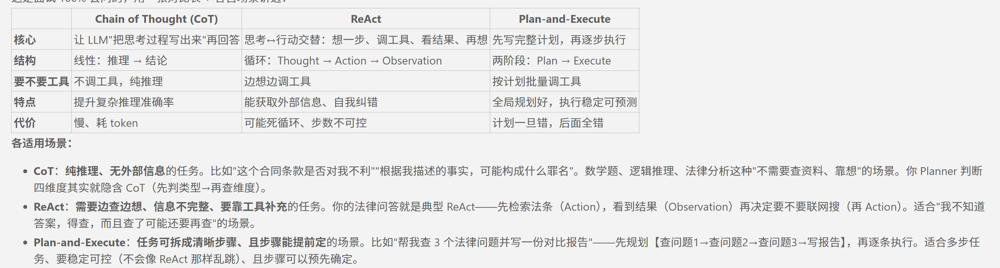

# 传统 RAG  VS agentic RAG

传统RAG是一条管道(固定流水线),原料进去,产品出来,中间没有分支,每步顺序固定，没有回头路。query → 无条件检索一次 → 拼进 prompt → LLM 生成 → 结束

agentic RAG RAG在这里变成一个检索的工具,由大模型来决定什么时候查,查什么,查几次

# React

React=reasoning（思考）+acting（行动）

Thought（想：我需要查什么）→ Action（调工具）→ Observation（看结果）→ 再 Thought…

首先先思考我需要什么，然后调用工具拿到结果，在进行思考，直到能回答为止，同时我还设置了**防死循环的兜底限制**，最多调用五轮工具

适合比较灵活复杂的任务可以边想边做根据具体情况进行调整

## react执行时候出错怎么办？

## chain of thought,plan and execute

chain of thought主要是让模型通过中间步骤一步步得到答案,它强调的是reasoning,也就是模型内部的分步思考,它比较适合逻辑数学这种**不一定需要调用外部工具**的任务.

plan and execute偏向于**先规划整体再执行**,适合**目标比较明确**的任务.**它的全局性更好**,但如果初始计划错误,后续执行会受到影响

# MCP 模型上下文协议

解决的是**AI应用怎么接入外部工具/数据源的标准化问题**//*工具跨模型复用的标准化问题*，是工具接入AI应用的标准化协议。 MCP里面通常有host client server三个角色，host是AI应用，client负责连接host和server ，server负责暴露外部工具，资源，和提示词，是外部能力提供方。

通过MCP 工具按照统一协议实现一次就可以被不同的agent平台调用

## 步骤

1. MCP server启动时**声明我有什么工具,调用工具**.

2. MCP **Client 连接把工具转换成不同模型需要的function calling格式**

3.**模型调用**，模型本身完全不知道MCP的存在，因为client已经转换成了各自模型所需要的格式

# skill

给agent增加某些专项能力的封装,可以理解为技能包
五个通用要素
1.**何时使用description**，写清楚触发场景
2.**步骤**，可执行的清单
3.例子，给**输入输出样例**
4.**边界**，什么时候不使用，不踩的坑
5.**输出格式**

# benchmark  基准测试

一组固定的任务和标准答案，用来公平量化系统的能力。三个要素即是**固定，有标准答案，可复现**我就做了一个五十道题目的测评题，用证据的命中率量化召回的质量

例子：MMLU 测试大模型的基准能力， HumanEval代码生成能力 ，GAIAagent助理任务

# LLM AS Judge

1.评判模型与被评判模型不能是同一个，防止大模型的**自评偏向**
2.**算分标准要写死**，提示词里面应该给出明确的维度，比如忠实度，完整度，相关度
3.盲评防位置偏见，**大模型对前面的答案有天然的偏向**
4.验证judge是否靠谱，可以抽一小部分题进行**人工评分**
5.**多次采样取平均**

我当时是怎么做的呢首先让deepseek的模型去把完整的链路跑一遍，把题目答案，gold_evidence,tool_uesd存json。把 {题目 + 标准法条依据 + 助手答案} 喂给 judge 模型，输出 {"verdict": 1/0, "reason": 一句话理由}，development 96.7%（29/30）、validation 100%（14/14）

**1.异构模型，2.多轮投票，3.只看事实点不看措辞**

# Linux命令

pwd ls cd cat 文件 tail -f 日志  top /kill PID

# workflow

工作流是llm和工具**在预先定义的代码路径**编排的系统，控制权在代码手里，反过来**他的对立面**是agent， agent是大模型动态自主指挥自己的流程和工具使用的系统。*可以让workflow管理主流程，而agent去处理具体的复杂的节点*

## workflow和agent结合

1. Workflow作为主流程，把agent放到某些智能节点中，比如说让agent去做文档总结，异常分析，或者是代码审查

2. agent作为决策者，判断某个任务适合某个标准流程后，调用workflow

3. 让agent去处理workflow中不稳定的，非结构化的节点，比如说意图识别，异常处理，和方案生成

# agent loop/agent 循环

*是llm完成任务的一个核心循环*,一般包括读取任务,思考判断,执行工具,返回结果,观察反馈,更新状态,判断是否继续.

每一轮agent会根据上下文和当前目标决定下一步,工具执行后返回observation,然后更新state,再进行下一轮决策,它存在的作用是让agent可以处理复杂,多步骤,不确定的任务.为了避免死循环一般会设置轮数

# agent runtime

**负责让agent真正跑起来的运行框架**,负责管理agent的状态,调用LLM,执行循环,工具调用,记忆,异常处理,权限控制和日志追踪.

大模型本身只是推理模型,而agent需要不断地进行规划行动观察和反馈,runtime就**负责调度这些板块**,让agent可以稳定地完成多步骤任务.

# agent harness 

是包裹在agent外层的**控制和测评框架**,用来给agent提供标准化任务环境,限制权限记录,执行过程,并验证最终结果.

# agent

**大模型为决策中心的智能体**,通过工具调用与环境交互,具备调用工具,记忆,规划和反思的能力,通过多步迭代完成任务

# 介 绍 项 目

这个项目是基于 LangGraph、RAG 和 FastAPI 的法律智能问答系统。整体流程是：用户提问先到前端，除少量固定问候语走快速回复外，其余消息都会经过 Planner 节点——它固定调用一次大模型做五分类意图识别，区分客观知识查询、个人案情咨询、闲聊、无关内容和情绪宣泄。只有个人案情咨询才会检查四个关键维度：事件、时间、损失、诉求，信息不全就追问，齐了才放行进入 ReAct 循环。循环里大模型自主决定调用两个工具：本地法条库的混合检索，FAISS 向量加 BM25 词面双路召回、RRF 融合后用 Reranker 精排 Top-5；另一个是联网搜索，主搜索失败自动兜底。工具结果返回后模型整合答案，先过幻觉守卫的两层规则校验，再通过 SSE 流式输出给前端，同时在后台更新案情摘要、持久化到 SQLite，刷新后会话仍可恢复。
dsh web

# 和 直 接 调 A P I 的 区 别

我觉得最主要的区别是更加的**可控**。首先我的agent它不会出现像API 容易去胡编乱造法条的问题，因为我强制让它去进行检索，其次就是**记忆和上下文**的问题，直接调API所以非常造成上下文不连贯

# 为 什 么 喜 欢 用 法 律 场 景

我觉得主要有以下几点原因，首先法律场景对**检索的要求更高**，因为他要求法条的准确程度。其次我觉得在现实生活中它是有**垂直落地的意义**的，再就是有**多轮对话的需求**这就更加适合本地agent。

# 工具调用失败怎么办？

## recursion_limit=12  防止工具调用死循环

因为一轮工具的调用占用两个递归(llm--tools--llm),12轮大概是五到六轮的,工具调用足够去兜底了，如果大模型反复调用工具停不下来就会**抛出异常**。

# 为什么用ollama本地的embedding

1. 免费ollama本地的nomic-embed-text不收费
2. 本地调用不需要走网络，而且建库的时候调用很多次不用在乎限流

# 讲 一 下 检 索 的 阶 段

# 工 具 的 schema 信 息 是 在 哪 一 步 注 入 的

**工具如果想要能够被LLM调用,就必须要知道这个工具有什么参数,参数是什么类型,这就是Json schema**

*函数签名function signature*：函数的名字和参数列表，包括参数名默认值是否必须要填类型

bind_tools:*把函数签名和docstring起变成JSON格式,在大模型调用的时候,一起注入到deepseek API里面*（{"name": "legal_rag_search", "parameters": {"query": {"type": "string"}}}）

工具呢schema不是手写的,而是bind_tools的时候用函数签名和docstring自动生成的,每次调用模型时schema会随着请求注入模型,根据这个来决定如何去调用如何去谈参数

# tool_calls 里面有什么

{
  "name": "legal_rag_search",
  "args": { "query": "劳动合同法第 46 条经济补偿" },
  "id": "call_abc123def456"
}

工具名字,
args:选好的参数字典,后面要去做pydantic校验,
id:拿到结果后，包装成 ToolMessage(content=结果, tool_call_id="call_abc123") 扔回 State

# function calling

首先llm需要知道工具的参数，也就是Json schema,然后大模型会对需要什么工具根据Json schema进行一个判断,输出tool_calls里面包含了他要调用什么工具,然后解析tool calls,进行工具的调用.将调用完的结果返回给大模型生成答案,这就是整个function calling的过程

# 多 agent 的 任 务 拆 分 不 清 楚 怎 么 办

首先任务拆分是让大模型自己去做的，但是模型具有随机性，**同一个任务拆除的子任务可能不一样，然后任务的边界模糊混乱**，就比如说b要a的输出，但如果a执行失败了怎么办？信息就会在agent的传递间丢失，递归拆分可能会失控。所以**生产上经常用workflow定死拆分逻辑**，只在复杂节点内部用agent

# function calling VS MCP

Function calling是**模型调用工具**的协议而MCP是**工具跨模型可以复用**的协议，他们不在一个层面上。
然后MCP解决了function calling的痛点，每个大模型的工具描述格式不一样，每个工具接入都需要重写一遍适配代码，

# 工 具 又 多 又 杂 上 下 文 多 容 易 调 错 工 具 怎 么 办

## llm调用工具的原理是什么

模型本质是通过下一个token预测来决定调不调用工具的
工具变多出现了问题一般就是三个:*提示词爆炸*,占上下文，*选错工具*，然后模型会在相似的工具间犹豫，就会造成调用失败，循环调用。*延迟高*，因为模型要从一百个工具里面去挑选，首token延迟增加

1. 减少工具数量可以合并的话就合并，但是也牺牲了一定的灵活性
2. 参数schema严格，减少模型瞎填
3. lazy loading 动态加载
4. *分层 router* 大
5. *工具检索*  大
6. *工具分组*  中等规模

## RAG for tools 工具检索

把每个工具的description转成向量，存入向量库，当用户提问时，将用户问题转向量之后，通过语义相似度检索top K，把最相关的五个工具喂给模型。这个方法只有当工具处>50时收益比较明显

## router

1. 纯router

┌──────────────────────────────────┐
│       Router Agent              │
│  （唯一看到所有工具的 Agent）    │
│                                  │
│  输入：用户 query                │
│  输出：要调的工具 + 参数         │
└──────────────────────────────────┘
                ↓
        ┌───────┼───────┐
        ↓       ↓       ↓
    Tool A   Tool B   Tool C  ← 工具不是 Agent，是函数

2. multi-agent

        Router Agent
        ┌───┼───┐
        ↓   ↓   ↓

   Agent A  Agent B  Agent C  ← 每个 Agent 都有自己的工具集
   (客服)   (销售)   (数据)
   工具1-5  工具6-10 工具11-15

3. router agent+子agent

        Router Agent
        ├→ 子 Agent 1（独立任务）
        ├→ 子 Agent 2（独立任务）
        └→ Tool（直接调用）

# 上 下 文 压 缩

分层记忆：把**记忆按"价值"分几层**放——① 窗口内：*最近几轮原文直接给模型*；② 摘要层：窗口外的历史压缩成*摘要*（你的 case_summary）；③ 向量层：**历史片段存 embedding，按相似度检索召回**。你项目已经做了前两层（历史截断 12 轮 + case_summary）。

向量记忆：把"用户说过的事实片段"（比如"我父亲 2020 年工伤""我之前咨询过劳动仲裁"）用 embedding **存进向量库，每次对话前检索相关的旧记忆注入**——解决"跨会话长期记忆"和"海量历史装不进窗口"的问题。代表：mem0、LangGraph Store、Zep。

# agent 长 时 间 运 行， 上 下 文 窗 爆 满 怎 么 办

# 为什么需要子agent

**1. 上下文隔离**

子agent有自己独立的上下文窗口，不会污染主agent。也不需要把主agent历史全部给子agent

**2. 并行**

主agent发布任务，子agent并发跑

**3. 职责和权限隔离**

搜索的agent只能搜索，coding agent可以改代码，deployment agent才有部署的权限。

**4. 异构模型**

子 agent可以用更小更便宜更专用的模型